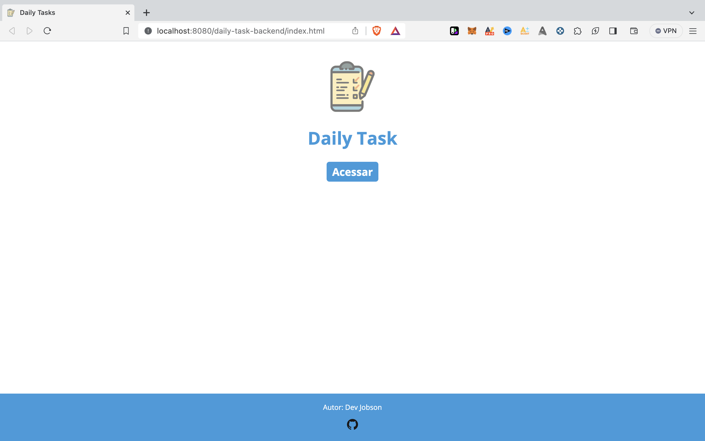
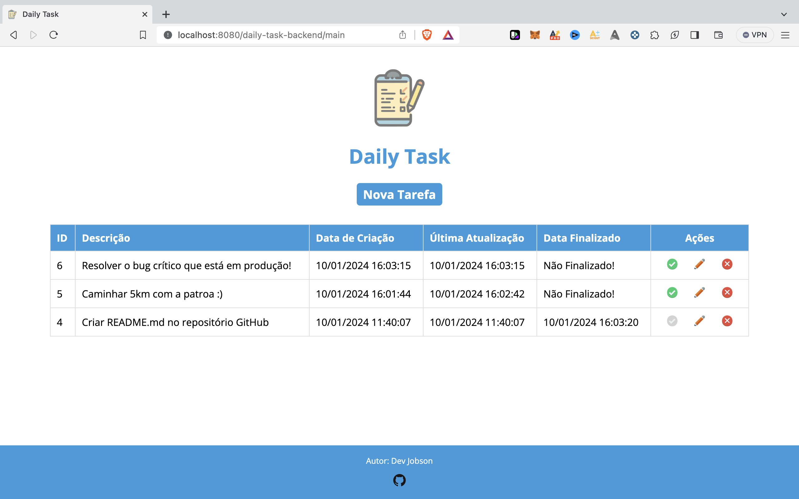
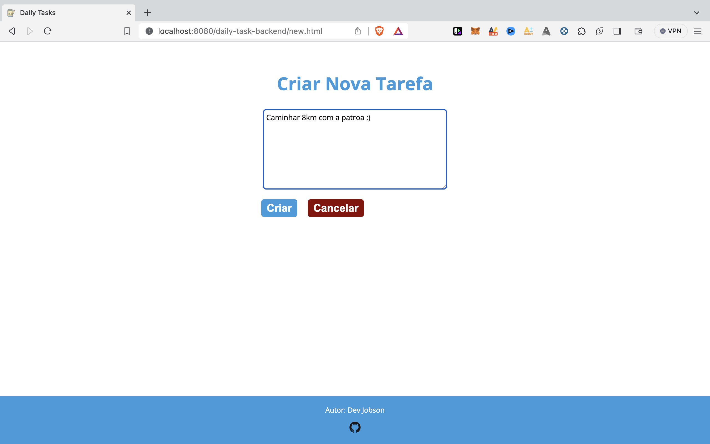
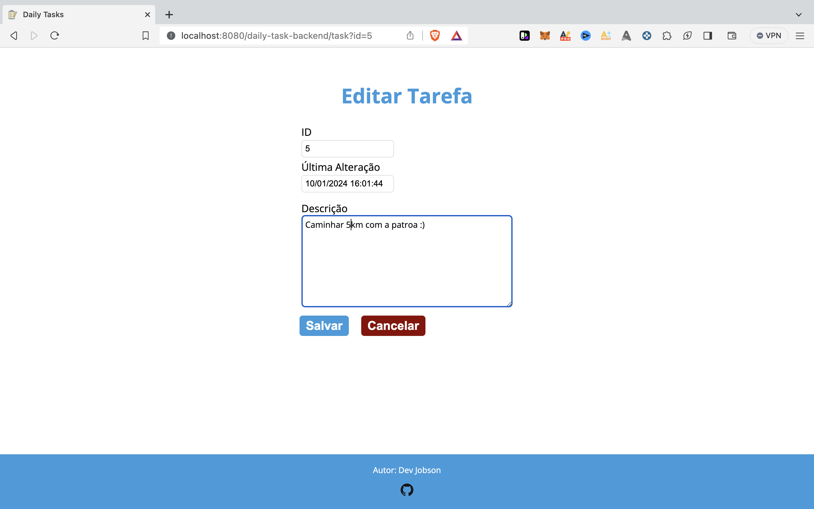

# Daily Task App

Este projeto consiste em uma aplicação web para o gerenciamento de tarefas, proporcionando uma interface simples e intuitiva para inserir, visualizar, alterar e excluir tarefas. A aplicação utiliza tecnologias como JSP e HTML para criar uma boa experiência para o usuário.

## Funcionalidades Principais

- **Visualização da Lista de Tarefas:**
  - Inclui uma grade (grid) que exibe as tarefas cadastradas.
  - Cada linha na grid possui três ações: Marcar como Feita, Alterar e Excluir.

- **Ação de Alterar Tarefa:**
  - Ao clicar em "Alterar", o sistema direciona o usuário para outra tela JSP/HTML com os dados da tarefa selecionada, permitindo a modificação.

- **Ação de Excluir Tarefa:**
  - Ao clicar em "Excluir", exibe uma confirmação para o usuário.
  - Se confirmada, realiza uma exclusão lógica no banco de dados, mantendo um registro histórico, mas removendo a tarefa da visualização principal.

- **Ação de Marcar Tarefa como Feita:**
  - Ao marcar uma tarefa como feita, a alteração é refletida no banco de dados.
  - O botão correspondente é atualizado para possibilitar a desmarcação da tarefa.

- **Inserção de Tarefas:**
  - Na tela principal, há um botão para inserir uma nova tarefa.
  - Ao clicar no botão, o usuário é redirecionado para a mesma tela de alteração, facilitando a consistência do fluxo de trabalho.

## Tecnologias Utilizadas

- Java Server Pages (JSP)
- HTML, CSS e Javascript
- MySQL
- Servlet
- Padrão de projeto MVC e DAO (camada que gerencia conexões com o banco de dados)

## Como Executar o Projeto

1. **Pré-requisitos:**
   - JDK 8 ou mais recente.
   - Apache Tomcat 8.5.
   - MySQL (Recomendável 8.1 ou mais recente) instalado e configurado.
   - Eclipse IDE recente.

2. **Clone o Repositório:**
   ```bash
   git clone https://github.com/jobson-batista/daily_task.git
   cd daily_task
   ```

3. **Importe o projeto no Elcipse IDE**
   - Importe o projeto no Eclipse usando a opção `General > Projects from Folder or Archive`.
   - Adicione o diretório do Apache Tomcat na IDE na aba `Servers` usando a perspectiva `Web` do Eclipse.

4. **Configuração do Banco de Dados:**
   - Configure o **usuário** (campo *user*) e **senha** (campo *password*) do seu banco de dados local na classe DAO `com.dailytask.model.DAO.java`.
   - Execute o script `scripts/CREATE_DATABASE_AND_TABLE.sql` para criar o banco de dados e a tabela `tarefa`.

5. **Execute a aplicação**
   - Selecione o arquivo `index.html` em `src > main > java > webapp > index.html`, clique com o botão direito em cima dele e vá em `Run As > Run on Server`

6. **Acesse a Aplicação:**
   - Abra o navegador e acesse `http://localhost:8080/daily-task-backend/index.html`.

7. **Imagens da Aplicação**

	<h4>7.1. Tela Inicial</h4>
  		
   
	<h4>7.2. Tela de Listagem de Tarefas</h4>
  		

	<h4>7.3. Tela de Criação de Tarefas</h4>
  		

	<h4>7.4. Tela de Edição de Tarefas</h4>
  		


  


   
